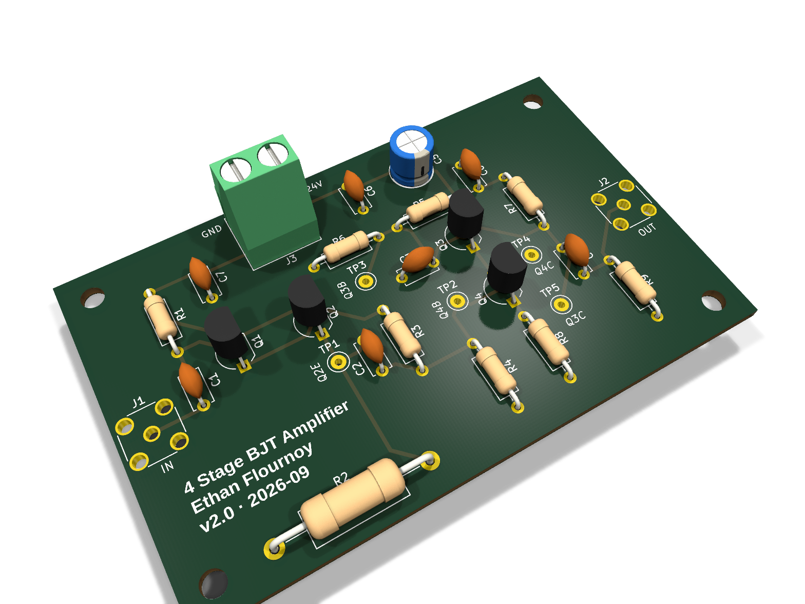
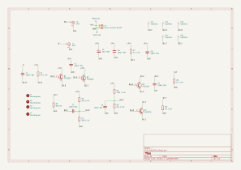

# 4-Transistor BJT Amplifier PCB

A discrete BJT amplifier — Darlington emitter follower into a cascode gain stage,
four PN2222A transistors on a +24 V supply — originally designed in PSpice for a
course, then re-implemented as a KiCad PCB. The first physical build was dead-bug
on copper clad and it died on test day from an under-rated resistor. This repo is
the rebuild: the same circuit, with the failure understood, the bias problem found
in simulation before ordering, and the whole thing laid out on a proper board.
The board and parts are ordered; nothing is assembled or measured yet, so every
number here is simulated and labeled as such.



*3D render of the KiCad layout. Not a photo — the board has not arrived yet.*

## Specification

| Spec | Target | Simulated | Measured |
|---|---|---|---|
| Voltage gain | ≥ 35 V/V | 38.8 V/V at 1 MHz | pending bring-up |
| Gain at test frequency | ≥ 35 V/V at 10 MHz | 38.1 V/V | pending bring-up |
| Input impedance | ≥ 300 kΩ | 934 kΩ at low frequency | pending bring-up |
| Power into 1 kΩ load | ≥ 10 mW | 11.0 mW at 127 mV input | pending bring-up |
| −3 dB bandwidth | ≥ 50 MHz | 64.5 MHz unloaded | pending bring-up |
| Supply current | — | 36.7 mA | pending bring-up |
| THD at 10 MHz | — | 5.4 % | pending bring-up |

Simulated figures are from ngspice (`sim/spice/amp_sanity_ngspice.cir`) using the
classic PSpice Q2N2222 model. The input impedance figure is from the original
PSpice run; it is a low-frequency number and falls below 300 kΩ around 70 kHz.

The bandwidth target started at 200 MHz, which assumed a breadboard
implementation. That was not practical at these frequencies, so the target was
revised to 50 MHz and the design was pushed to about 60 MHz in simulation to
leave margin for losses on the bench.

## Circuit



**Stage 1 — Q1/Q2 Darlington emitter follower.** Biased through R1 (1 MΩ). The
Darlington multiplies the input resistance by both betas, which is what buys the
≥ 300 kΩ input impedance. Gain is just under 1; this stage exists to not load the
source.

**Stage 2 — cascode.** Q4 is the common-emitter gain device, Q3 is common-base
stacked on top of it. Q3 holds Q4's collector at a nearly fixed voltage, so Q4's
collector-base capacitance sees almost no voltage swing. That kills the Miller
multiplication that would otherwise dominate the high-frequency rolloff, and it
is the reason a 60 MHz bandwidth is reachable with parts this cheap.

R7 (1 kΩ) is the collector load, C4 couples to the 1 kΩ load resistor R9, which
lives on the board so the amplifier can be tested without hanging a load off the
SMA jack.

| PSpice name | KiCad ref | Value | Note |
|---|---|---|---|
| Rb1 | R1 | 1 MΩ | stage 1 bias |
| Re | R2 | 910 Ω, 2 W | the part that killed the first build |
| R3a | R3 | 10 kΩ | Q4 bias divider, top |
| R3b | R4 | 360 Ω | Q4 bias divider, bottom — bench-tuned |
| R4a | R5 | 100 kΩ | Q3 base divider, top |
| Rb4 | R6 | 22 kΩ | Q3 base divider, bottom |
| Rc | R7 | 1 kΩ 1% | collector load |
| Re3 | R8 | 10 Ω | Q4 emitter degeneration |
| RLoad | R9 | 1 kΩ 1% | on-board load |
| C2 | C1 | 100 nF | input coupling |
| C4 | C2 | 100 nF | interstage coupling |
| C1 | C3 | 100 nF | Q3 base bypass |
| C3 | C4 | 100 nF | output coupling |

Also on the board: C5 (10 µF) and C6–C8 (100 nF) for supply decoupling, J1/J2 SMA
jacks, J3 screw terminal for +24 V, and TP1–TP5 bias test points.

## The design story

### Test-day failure

The first build was dead-bug on copper clad. It was destroyed during testing.

Root cause, found afterward: R2, the stage-1 emitter resistor, carries the whole
Darlington bias current. At 910 Ω and about 24 mA that is

    P = I²R = (0.024)² × 910 ≈ 0.52 W

It was a 1/4 W part. It ran at roughly twice its rating, overheated, and took the
board with it. Nothing in the simulation flagged this, because a PSpice resistor
has no power rating — the number was right there in the operating point the whole
time and I never divided it out.

The board was rebuilt dead-bug afterward, on my own time, and it worked. I did not
record numbers from that rebuild, so nothing from it is quoted here.

### What the PCB does about it

- R2 is now a 2 W part (KOA MOS2, 910 Ω), mounted raised off the board so it can
  shed heat into air instead of into the substrate
- supply decoupling: 10 µF plus 100 nF at the input, 100 nF at each stage
- TP1–TP5 test points on the bias nodes, so the DC state can be checked before a
  signal ever goes in
- solid ground plane on the bottom layer
- SMA jacks instead of clip leads, and the load resistor on the board

### Pre-order sanity check: the output was clipping

Before sending the board out, I re-ran the design in ngspice and LTspice and found
a second problem, quieter than the first one.

The output stage biased at about 6.6 mA. The most positive swing a common-emitter
stage can deliver is limited by that bias current into the AC load:

    V_peak(max) = I_bias × (R7 ∥ R9) = 6.6 mA × 500 Ω = 3.3 V

Getting 10 mW into 1 kΩ needs 4.47 V peak. So the positive half of the output ran
out of current before it reached the target. That is exactly the lopsided
+3 V / −5.2 V waveform in the original PSpice output-power plot, and why that run
read about 9.6 mW instead of 10 mW, with about 13 % distortion. I had read that
plot as "close enough" at the time. It was not close enough — it was clipping.

The fix is values only, no layout change:

| Part | Course design | PCB | Effect |
|---|---|---|---|
| R8 (Q4 emitter) | 9.1 Ω | 10 Ω | sets stage gain and degeneration |
| R4 (bias divider, bottom) | 330 Ω | 360 Ω | raises Q4 bias current |

That moves the output-stage bias from about 6.6 mA to about 10.6 mA, which puts
the positive swing limit above what 10 mW needs. Reproduced in ngspice:

| | R4 = 330, R8 = 9.1 | R4 = 360, R8 = 10 |
|---|---|---|
| Q4 bias current | 6.6 mA | 10.6 mA |
| Output swing | +3.02 V / −5.27 V | +4.08 V / −5.14 V |
| Power into 1 kΩ | 9.54 mW | 11.0 mW |
| THD at 10 MHz | 13.2 % | 5.4 % |
| Gain at 1 MHz | 37.1 V/V | 38.8 V/V |
| Supply current | 32.8 mA | 36.7 mA |

The schematic and the ordered BOM carry the fixed values. Swap the `.param` line
in the ngspice netlist back to `R4v=330 R8v=9.1` to reproduce the clipped case.

R4 is still marked bench-tuned, because this bias point is genuinely twitchy: it
is set by a sub-1 V divider working against one Vbe drop. A ±5 % part tolerance on
R4 moves the collector current by roughly ±25 %, and warming Q4 by 25 °C adds
roughly another 30 %. A resistor value is not a substitute for actually measuring
the node.

> **TODO:** full re-simulation of the as-built values with a second transistor
> model, with screenshots. The figures above are from a single-model ngspice run.

## Bring-up plan

Nothing below has been done yet.

1. **Set the bench supply to 24 V with a 50 mA current limit** before connecting
   anything. Expected draw is about 37 mA; anything near the limit means a fault.
2. **Check the DC test points with no input signal** against the table below.
3. **Tune R4** to bring Q3_C to its target. This is the trim that sets output
   headroom — too low and the positive half clips again, too high and the negative
   half does.
4. **Set the function generator to High-Z output mode.** In 50 Ω mode it will
   deliver half the amplitude it displays, which would make the gain read 2× low.
5. **Measure gain at 1 MHz and 10 MHz** with a properly compensated 10× probe.

### Expected DC test points (simulated, no signal)

| Test point | Node | Expected |
|---|---|---|
| Q2_E | stage-1 emitter | 21.6 V |
| Q4_B | Q4 base | 0.81 V |
| Q3_B | Q3 base | 3.37 V |
| Q4_C | Q4 collector | 2.67 V |
| Q3_C | output stage collector | 13.5 V — **R4 trim target** |

> **TODO:** measured column, once the board is populated.

## Measurement caveats

The output node sits at about 500 Ω (R7 ∥ R9). A 10× scope probe adds 10–15 pF
there, and that capacitance against 500 Ω forms a pole well below the amplifier's
own bandwidth. The bench will not measure 64 MHz, and that is the probe, not the
board:

| Probe capacitance | Gain at 1 MHz | Gain at 10 MHz | −3 dB bandwidth |
|---|---|---|---|
| none (ideal) | 38.8 | 38.1 | 64.5 MHz |
| 10 pF | 38.8 | 35.5 | 22.4 MHz |
| 15 pF | 38.8 | 33.3 | 16.6 MHz |

All simulated. A 1× probe or a length of coax into a 1 MΩ input is far worse —
roughly 115 pF — and would put the corner near 2 MHz. Gain at 1 MHz is unaffected,
so that is the honest number to compare against the 35 V/V spec.

## Lessons learned

- **A simulator will not tell you a part is about to burn.** Power rating is not
  in the model. Check I²R on every resistor carrying real current, before ordering.
- **"Close enough" on a plot deserves a second look.** The 9.6 mW reading was 4 %
  off the spec and I let it go. The reason it was 4 % off was clipping, which is a
  design error, not measurement slop.
- **Output swing is set by bias current, not by supply voltage.** 24 V on the rail
  does nothing if the stage can only source 6.6 mA into 500 Ω.
- **Bias points built on one Vbe drop need a trim, not a tighter tolerance.**
- **The instrument is part of the circuit.** A 10× probe cuts the measured
  bandwidth of this design by two thirds.
- **Test points are cheap.** Five pads make the difference between measuring the
  bias and guessing at it.

## Status and roadmap

- [x] PSpice design, course version
- [x] Dead-bug build — destroyed on test day
- [x] Root cause found: R2 power rating
- [x] Dead-bug rebuild, worked (no numbers recorded)
- [x] KiCad schematic and layout, DRC clean
- [x] Pre-order simulation check, bias fix applied to the schematic
- [x] PCB ordered from JLCPCB
- [x] Parts ordered from DigiKey
- [ ] Board and parts arrive
- [ ] Assemble
- [ ] Bench bring-up: test points, R4 trim
- [ ] Measure gain, bandwidth, output power, input impedance
- [ ] Full re-simulation with a second transistor model, with screenshots
- [ ] Photos of the assembled board and scope captures

## Repository layout

```
hardware/   KiCad project (schematic, PCB, footprints)
sim/pspice/ original PSpice screenshots and parts list from the course design
sim/spice/  LTspice sanity netlist and its ngspice port
docs/       exported schematic, 3D renders, photos
fab/        gerbers, drill files, BOM
scripts/    export.sh, regenerates everything in docs/ and fab/
```

Regenerate all artifacts after a KiCad change:

```sh
./scripts/export.sh
```

Run the simulation:

```sh
ngspice -b sim/spice/amp_sanity_ngspice.cir
```

> **TODO:** `docs/photos/` is empty. Dead-bug build photo, assembled PCB, and
> scope captures go there.

## Tools

KiCad 10.0.5 (schematic, layout, fabrication output), PSpice (original course
design), LTspice and ngspice 47 (pre-order verification).

## Notes on the simulation files

`sim/spice/amp_sanity.cir` is the LTspice version: one analysis at a time, with
`.meas` cards read out of the SPICE error log. `sim/spice/amp_sanity_ngspice.cir`
is the ngspice port — `SINE(` becomes `SIN(`, and the `.meas` cards move into a
`.control` block so all three analyses run in a single pass.

`sim/pspice/` holds the original course-design screenshots. Two things to know
about them: `outputpower.png` is the **pre-fix** run showing the clipped ~9.6 mW
result, and a fourth screenshot (`schematicRe2_2kBiasPoints.png`) was removed
because it was mislabeled — it showed the 910 Ω bias numbers, not the 2.2 kΩ ones.
